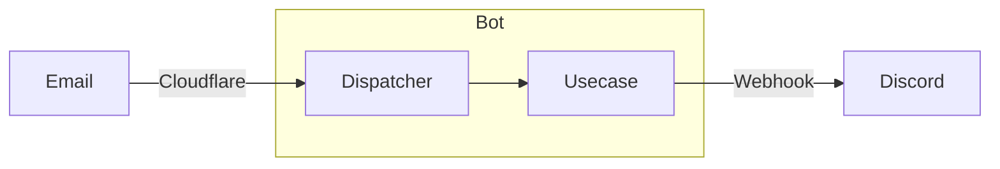
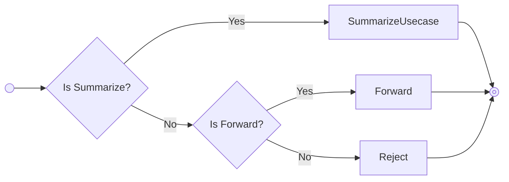

# Ruby Information Bot (zh-TW)

The design of Discord Bot and how to contribute to it.

---
layout: center
---

<About>
https://blog.aotoki.me/<br />
@elct9620
</About>

---

<Toc />

---
layout: section
---

# Architecture

---
hideInToc: true
---

# Environment

To archive the low-cost and pay-as-you-go architecture, choose the following services:

* Hosted on Cloudflare Workers
* Email routing by Cloudflare
* LLM powered by OpenAI

<!--
US developer have higher salary than TW developer, but the cost of OpenAI API is the same. 😭
-->

---
layout: center
---



---
layout: center
---



---
layout: section
---

# Summarize Feature

---
hideInToc: true
---

# Summarize Usecase

<v-clicks every="2">

* Find Issue
```ts
export interface IssueRepository {
	findById(id: number): Promise<Issue | null>;
}
```

* Summarize
```ts
export interface SummarizeService {
	execute(issue: Issue): Promise<string>;
}
```

* Output
```ts
export interface SummarizePresenter {
	setTitle(title: string): void;
	setType(type: string): void;
	setLink(link: string): void;
	setDescription(description: string): void;
}
```

</v-clicks>

---
hideInToc: true
---

## Issue Repository

Get issue data via Redmine.


```ts {*|2|6,8|11-12,15}{lines: true}
export class RestIssueRepository implements IssueRepository {
	public static readonly API_URL = 'https://bugs.ruby-lang.org/issues';

	async findById(id: number): Promise<Issue | null> {
		try {
		    const url = `${RestIssueRepository.API_URL}/${id}.json?include=journals`;

			const response = await fetch(url);

			// ...
			const issue = new Issue(id);
			issue.subject = data.issue.subject;
			// ...

			return issue;
		} catch (error) {
		    // ...
		}
    }
}
```

---
hideInToc: true
---

## Summarize Service

Summarize the issue via OpenAI API.

```ts {*|2|5-7|9-12|14}{lines: true}
export class AiSummarizeService implements SummarizeService {
	constructor(private readonly llmModel: LanguageModel) {}
	async execute(issue: Issue): Promise<string> {
	    // ...
	    const prompt = Mustache.render(promptTemplate, {
	        // ...
	    })

	    const { text } = await generateText({
			model: this.llmModel,
			prompt,
		});

		return text;
    }
}
```

---
hideInToc: true
---

<style>
code.language-md {
    text-wrap: auto;
}
</style>

## Summarize Prompt

Explain the summarize rules, need to be improved.

```md {*|1|4-10|13-}{lines: true, maxHeight: '400px', textWrap: 'auto'}
Your mission is converting the issue latest journal to technology news, helping the user understand the current status of the issue.

You need to follow these rules:
1. You MUST use Traditional Chinese (Taiwan)
2. Use simple and clear language under 3000 characters.
3. NEVER add any extra information not in the original issue.
4. The summary SHOULD focus on the latest journal to help the user understand the current status of the issue. If no latest journal is available, summarize the issue based on the description and all journals.
5. If the code is important, you can include it in the summary.
6. You can use emojis to make it more readable in message platforms.
7. Make sure the context is clear and easy to understand the issue status.


Below is the issue information:

Subject: {{subject}}
Type: {{type}}
Author: {{authorName}}
{{#assigneeName}}
Assignee: {{assigneeName}}
{{/assigneeName}}

Description:
{{description}}

{{#latestJournal}}
Latest Journal:
{{userName}}:
{{notes}}

{{/latestJournal}}

{{#journals.length}}
All Journals:
{{#journals}}
{{userName}}:
{{notes}}

{{/journals}}
{{/journals.length}}
```

---
hideInToc: true
---

## Summarize Presenter

Send the summary to Discord.

```ts {*|4-11|13-17}{lines: true}
export class DiscordSummarizePresenter implements SummarizePresenter {
    async render(webhookUrl: string): Promise<boolean> {
        // ...
        const payload = {
            embeds: [
                {
                    title: `${emoji} ${this.title}`,
                    // ...
                }
            ]
        }

        const response = await fetch(webhookUrl, {
			method: 'POST',
		    // ...
			body: JSON.stringify(payload),
        });

		// ...
    }
}
```

---
layout: section
---

# Roadmap

---
hideInToc: true
---

## Web UI

Minimal web UI for developers to test the bot.

* Manual trigger for development
* Test / Preview the modified prompt

---
hideInToc: true
---

## Deduplication

Avoid repeated same issue in the short time.

* Group by issue ID
* Avoid flooding the channel

The `Durable Object` is planned which use it's alarm feature to flush summarize to the channel.

---
hideInToc: true
---

## Summarize Template

Make the summarize format is fixed.

* Easy to read
* Have same structure

---
layout: section
---

# How to Contribute

---
layout: center
---


https://github.com/elct9620/ruby-info-zhtw

---
layout: section
hideInToc: true
---

# Thanks
