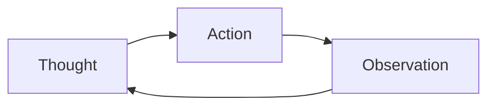
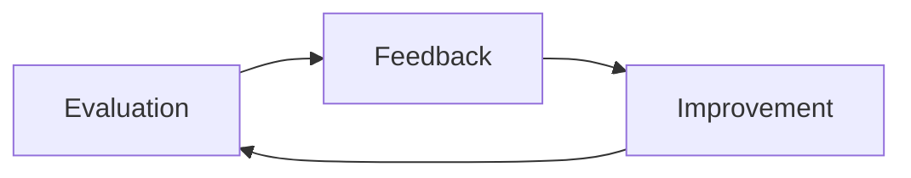
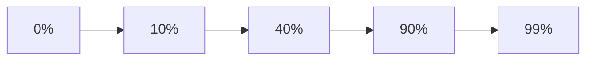

<v-switch>
<template #0>

# Crafting AI-Friendly Application in Ruby

關於 AI 讓這個主題講不下去的故事

</template>
<template #1>

# Crafting AI-Driven Workflows for Ruby

只好趁亂改主題

</template>
</v-switch>


---
layout: center
---

<v-switch>
     <template #0>
        <About>
        https://blog.aotoki.me/<br />
        @elct9620
        </About>
    </template>
    <template #1>
        <About title="Associate AI Engineer">
        https://blog.aotoki.me/<br />
        @elct9620
        </About>
    </template>
</v-switch>

---
hideInToc: true
---

# Disclaimer

內容難度設定在有軟體開發經驗都能做到

- 非 Machine Learning 專業
- 這週是在新團隊第二週
- 最近剛開始讀論文
- 主修多媒體
- 畢業很多年沒讀書了（？）

<p>如果有錯太嚴重的地方歡迎指正</p>

---

<Toc />

---
layout: section
---

# Bias

程式語言鄙視鏈？

---
hideInToc: true
---

# Write a script

````md magic-move
```md
撰寫一個腳本從 example.com 抓
```
```md
撰寫一個腳本從 example.com 抓取資料
```python
```
````

<p v-click>很高機率出現 Python 🤷</p>

---
hideInToc: true
---

# Probability

接下來產生的文字，是一種機率問題

| Language | Weight |
|----------|--------|
| Python   | 0.7    |
| Bash     | 0.2    |
| Ruby     | 0.1    |

<p v-click>Python 是熱門的語言，統計上更可能被選擇</p>

---
hideInToc: true
---

# Bias

偏見是因為訓練資料所產生

- 用 Clean Architecture 總是會用 Domain-Driven Design
- 用 Ruby 總是會用 Rails

<p v-click>善用這個特性可以提高我們想生成的內容</p>

---
hideInToc: true
---

## Prompt Engineering

透過提示來改變後續生成的機率

| Token               | Probability |
|---------------------|-------------|
| Ruby -> `def`       | 0.8         |
| Python -> `def`     | 0.8         |
| JavaScript -> `def` | 0.2         |

---
layout: section
---

# In-Context Training

用提示來影響後續生成的權重

---
hideInToc: true
---

# One-Shot

````md magic-move
```ruby{*|2}{lines:true}
# Best Practice
it { is_expected.to be_valid }
```
```ruby{*|6}{lines:true}
# Best Practice
it { is_expected.to be_valid }

# ...

it { is_expected.to be_invalid }
```
```
````

---
hideInToc: true
---

# Few-Shot

````md magic-move
```ruby{*|2}{lines:true}
# Best Practice
it { is_expected.to be_valid }
```
```ruby{*|5}{lines:true}
# Best Practice
it { is_expected.to be_valid }

# Bad Practice
it { expect(example).to be_invalid }
```
```ruby{*|9}{lines:true}
# Best Practice
it { is_expected.to be_valid }

# Bad Practice
it { expect(example).to be_invalid }

# ...

it { is_expected.to be_invalid }
```
````

---
hideInToc: true
layout: center
---

## Context

文件、原始碼、提示都會影響後續的生成

---
hideInToc: true
---

## Context Engineering

簡單來看，是一種巧妙排列組合內容的專業

- 調整順序
- 組合內容
- 引導生成
- 重組脈絡

<p v-click>某段文字何時出現、重複出現都可能改變後續產生的機率</p>

---
layout: section
---

# Evaluation

提示真的有發揮作用嗎？

---
hideInToc: true
---

# Human as a Judge

「你應該要用 `it { is_expected.to be_valid }` 來寫測試」

- 檢查速度慢
- 專業知識表現更好

---
hideInToc: true
---

# LLM as a Judge

可能因為偏見或者資料不足，得到錯誤的結論

- 檢查速度快
- 存在幻覺、大量偏見

---
hideInToc: true
---

# Challenge

設計好的評估條件非常困難

- 加強測試能力，就會弱化實作能力
- 條件不明確會產生誤判
- 評估方式錯誤會造成結果偏離
- 用 AI 評分很難穩定

<p v-click>你 Code Review 的基準是什麼？</p>

---
layout: section
---

# Self-Improvement

你是一個成熟的 AI，該自己學寫程式了！

---
hideInToc: true
layout: center
---

## Demo #1

先暖身一下，我們看一下沒練過的 AI 表現怎樣

---
hideInToc: true
---

# Meta Prompting

Meta Prompting 遠比想像常見

- Claude Code 的 `/init`
- Claude Code 的 Agent 生成
- Spec-Driven Development (AWS Kiro)

<p v-click>用 Context Engineering 的角度思考，所有文本是否都可以是提示？</p>

---
hideInToc: true
---

# ReAct

先思考，再採取行動

<v-switch>
<template #0>

</template>
<template #1>


稍微改一下就能變成自我改進的流程

</template>
</v-switch>

---
hideInToc: true
---

# Claude Code SDK

你試過用 SDK 呼叫 Command 和 Agent 嗎？

````md magic-move
```ts{*|6}{lines:true}
import { query, type SDKMessage } from "@anthropic-ai/claude-code";

const messages: SDKMessage[] = [];

for await (const message of query({
  prompt: "/spec:execute example-feature 1",
  abortController: new AbortController(),
  options: {
    maxTurns: 3,
  },
})) {
  messages.push(message);
}

console.log(messages);
```
```ts{*|6}{lines:true}
import { query, type SDKMessage } from "@anthropic-ai/claude-code";

const messages: SDKMessage[] = [];

for await (const message of query({
  prompt: "Use ruby-developer agent to implement the feature",
  abortController: new AbortController(),
  options: {
    maxTurns: 3,
  },
})) {
  messages.push(message);
}

console.log(messages);
```
````

<p v-click>Claude Swarm Gem 使用類似的方式實現</p>

---
hideInToc: true
---

# Evaluation Design

- 讓 Agent 專注單一任務（如：開發、測試）
- 讓 Agent 專注處理單一檔案
- 以規則說明得分方式

<p v-click>這樣可以確保評估相對準確，要考慮的問題也更單純</p>

---
hideInToc: true
---

<style>
.slidev-code {
    text-wrap: auto;
}
</style>

# Evaluation Instruction

讓 Agent 更喜歡用 `it { is_expected.to be_valid }` 來寫測試

````md magic-move
```md
你是一名專業的 RSpec 測試專家，會根據提供的檔案進行評分。

我們偏好使用 it { is_expected.to be_valid } 來寫測試，請確保所有測試都符合這個標準。

根據表現，使用 <PERFORMANCE> </PERFORMANCE> 來標記分數，範圍是 0.0 到 1.0。
如：一共有 10 個 `it` 測試，只有 5 個符合 `it { is_expected.to be_valid }` 標準，則回傳 <PERFORMANCE>0.5</PERFORMANCE>

Input: ...
Output: ...
```
```md
你是一名專業的 RSpec 測試專家，會根據提供的檔案進行評分。

我們偏好使用 it { is_expected.to be_valid } 來寫測試，請確保所有測試都符合這個標準。

根據表現，使用 <PERFORMANCE> </PERFORMANCE> 來標記分數，範圍是 0.0 到 1.0。
如：一共有 10 個 `it` 測試，只有 5 個符合 `it { is_expected.to be_valid }` 標準，則回傳 <PERFORMANCE>0.5</PERFORMANCE>

Input: ...
Output: ...

(Reasoning...)

<PERFORMANCE>0.8</PERFORMANCE>
```
````

<p v-click>初期可以先從簡單的條件開始</p>

---
hideInToc: true
---

# Feedback Design

依靠 Evaluation 的結果，後續的調整不夠完善

- 讓 AI 分析失敗原因
- 幫 AI 設定改進目標
- 讓 AI 提出改進方案

---
hideInToc: true
---

# Feedback Instruction

讓 Claude Code 根據 Evaluation 設定改進目標

````md magic-move
```md
你是專業的提示改善系統，你會根據 System Prompt 提出建議，更加接近使用者所設定的目標。

<SYSTEM_PROMPT>...</SYSTEM_PROMPT>
<OUTPUT>...</OUTPUT>
<EVALUATION>...</EVALUATION>
<OBJECTIVE>
根據上述的內容，提出改進的方針確保總是使用 `it { is_expected.to be_valid }` 來寫測試。
</OBJECTIVE>

將建議寫在 <FEEDBACK> </FEEDBACK> 標籤中。
如：<FEEDBACK>加入關於 it { is_expected.to be_valid } 的範例</FEEDBACK>
```
```md
你是專業的提示改善系統，你會根據 System Prompt 提出建議，更加接近使用者所設定的目標。

<SYSTEM_PROMPT>...</SYSTEM_PROMPT>
<OUTPUT>...</OUTPUT>
<EVALUATION>...</EVALUATION>
<OBJECTIVE>
根據上述的內容，提出改進的方針確保總是使用 `it { is_expected.to be_valid }` 來寫測試。
</OBJECTIVE>

將建議寫在 <FEEDBACK> </FEEDBACK> 標籤中。
如：<FEEDBACK>加入關於 it { is_expected.to be_valid } 的範例</FEEDBACK>

(Reasoning...)

<FEEDBACK>...</FEEDBACK>
```
````

<p v-click>給予調整的目標，讓 LLM 思考改進方案</p>

---
hideInToc: true
---

# Improvement Instruction

有 Feedback 後，讓 Claude Code 進行改寫

````md magic-move
```md
你是專業的提示改善系統，你會修改 System Prompt 以符合使用者的目標。

<SYSTEM_PROMPT>...</SYSTEM_PROMPT>
<FEEDBACK>...</FEEDBACK>
<OBJECTIVE>
根據上述的內容，修改 System Prompt 確保總是使用 `it { is_expected.to be_valid }` 來寫測試。
</OBJECTIVE>

將改進的版本寫在 <IMPROVED_SYSTEM_PROMPT> </IMPROVED_SYSTEM_PROMPT> 標籤中。
如：<IMPROVED_SYSTEM_PROMPT>...</IMPROVED_SYSTEM_PROMPT>
```
```md
你是專業的提示改善系統，你會修改 System Prompt 以符合使用者的目標。

<SYSTEM_PROMPT>...</SYSTEM_PROMPT>
<FEEDBACK>...</FEEDBACK>
<OBJECTIVE>
根據上述的內容，修改 System Prompt 確保總是使用 `it { is_expected.to be_valid }` 來寫測試。
</OBJECTIVE>

將改進的版本寫在 <IMPROVED_SYSTEM_PROMPT> </IMPROVED_SYSTEM_PROMPT> 標籤中。
如：<IMPROVED_SYSTEM_PROMPT>...</IMPROVED_SYSTEM_PROMPT>

(Reasoning...)

<IMPROVED_SYSTEM_PROMPT>...</IMPROVED_SYSTEM_PROMPT>
```
````

<p v-click>實務上，提供哪些 Context 能提高改善的品質，會需要花時間探索</p>

---
hideInToc: true
---

# Candidate Selection

根據 Evaluation 的評分，選擇最高分的版本

- 開始跟結束都運行 Evaluation
  - 開始 - 取得比較基準
  - 結束 - 確認是否有改善
- 使用 Performance 進行比較
- 以最高分版本持續進行改善
- 檢查訓練紀錄確定沒有問題

<p v-click>目標不是 100% 完美，而是大部分條件都接近理想</p>

---
hideInToc: true
---

# Strategy

漸進式的改進，而非一次性改進



<p v-click>目標是減少變異，讓成果逐步接近預期</p>

---
hideInToc: true
---

# Future Work

這只是很簡單的設計，已經有論文證實有效

- 加入不同的案例學習多種情況（Dataset）
- 使用外部工具評分和回饋（如：Rubocop）
- 根據不同情境設計提示

<p v-click>預定會做工具給自己用，但何時完成時間未定</p>

---
hideInToc: true
layout: center
---

## Demo #2
這次我們來看看有訓練過的 AI 表現怎樣

---
layout: section
---

# Theory
來看幾篇有趣的論文

---
hideInToc: true
---

# DSPy

https://github.com/stanfordnlp/dspy

- 像寫程式一樣開發 AI 應用
- 提供訓練功能
- 大部分功能依賴 DSPy
- 適合設計工作流程的情境

---
hideInToc: true
---

# TextGrad

https://github.com/zou-group/textgrad

- 受到 DSPy 訓練功能的啟發
- 使用跟 Machine Learning 相同的方式，參考 PyTorch 的設計
- 將「提示」看作函式，用於評估
- 採用「自動梯度」來嘗試得到最佳的結果
- 適合針對特定能力加強

<p v-click>這場演講的主要理論參考</p>

---
hideInToc: true
---

# PREFER

https://github.com/zcrwind/PREFER

- 針對失敗的情境加強
- 產生多個提示對應不同情境
- 用多個提示投票選出最佳解
- 根據使用者回饋反思並且調整

<p v-click>目前還沒讀過 DSPy 整體來說 TextGrad 比較容易上手</p>

---
hideInToc: true
layout: section
---

# End
歡迎提問
